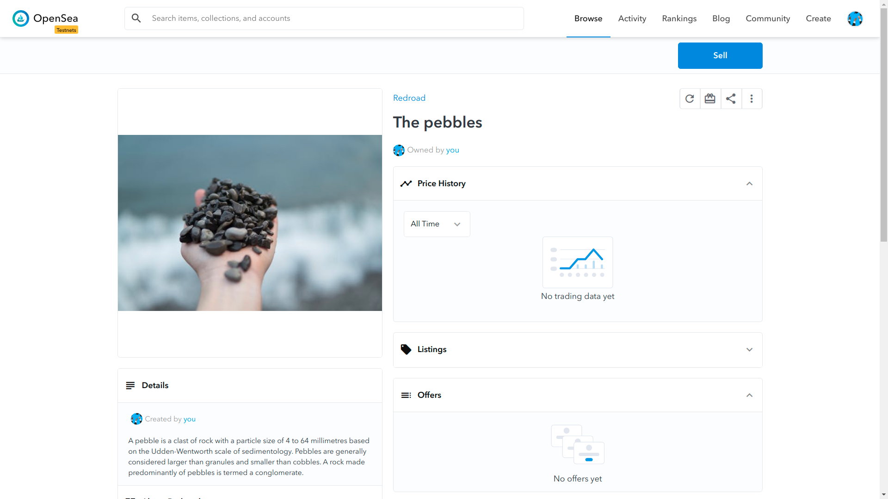

# ERC721-REDROAD


## Commands
 - `yarn test`: running the test scripts
 - `yarn migrate`: migrate to rinekby
 - `yarn verify`: verify on etherscan

## How to deploy your NFT on **rinkeby**?
 - Install using `yarn`
 - Rename `.env.example` to `.env` and set the values of environment variables accordingly
 - Set the `tokenURI` in `3_run.js`
 - Set the uri & nfts in the `meta` directory
 - Run `yarn migrate` to deploy the contracts to rinkeby
 - Run `yarn verify` to verify the contracts on etherscan
 - Visit *https://testnets.opensea.io/* and enter the address of above deployed `Redroad` contract
 - **Enjoy with your NFTs!!!**

## Deployments
 - [Redroad](https://rinkeby.etherscan.io/address/0x19042381269FBDada8F0dAf01B4c7b21D51E6E5A#readContract)
 - [Token on Opensea](https://testnets.opensea.io/assets/0x19042381269fbdada8f0daf01b4c7b21d51e6e5a/1)

## Dependencies
```
"dependencies": {
    "@openzeppelin/contracts": "^3.4.1",
    "@truffle/hdwallet-provider": "1.0.40",
    "dotenv": "^8.2.0",
    "truffle": "^5.2.6",
    "truffle-plugin-verify": "^0.5.7"
}
```

## Resources
 - https://ethereum.org/en/developers/docs/standards/tokens/erc-721/
 - https://docs.openzeppelin.com/contracts/3.x/erc721
 - https://github.com/ethereum/EIPs/issues/721
 - https://github.com/OpenZeppelin/openzeppelin-contracts/blob/master/contracts/token/ERC721/ERC721.sol
 - http://erc721.org/
 - https://medium.com/crypto-currently/the-anatomy-of-erc721-e9db77abfc24
 - https://education.district0x.io/general-topics/understanding-ethereum/erc-721-tokens/ 
 - https://decrypt.co/resources/erc721-what-is-it-guide-ehtereum-token